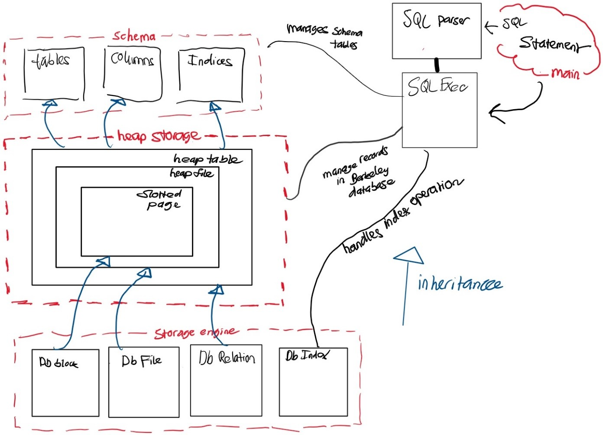

# Relation Manager

## Overview

This project consists of a bare bones
implementation of a relation manager. 

A relation manager is part of a full DBMS and is 
usually the core of the system.
What is implemented within this repo does not 
do everything, but is able to handle some
rather complicated queries. 

This project was constructed during a 6 week summer CPSC5300 Physical Databases course at Seattle University during the summer of 2018. 

Given the size of the application, and the limited amount of time within the course, about half of the code, each sprint, was provided
by Professor Kevin Lundeen to ensure a timely delivery and working product.


## Dependencies

This project has a couple of dependencies:/
1. An SQL parser through Hyrise
2. Berkeley DB's low level file management as our file manager

Provided in this repo is the `sql_parser` that we will use when the user inputs a query. You will
need to install berkeley db locally on your machine. You can find the installation of this [Here](http://www.oracle.com/technetwork/database/database-technologies/berkeleydb/downloads/index.html)

If you choose to install Berkley DB, you will also want to configure Berkeley DB to have the C++ wrappers and for both 32-bit and 64-bit

`../dist/configure --enable-cxx LDFLAGS='-arch x86_64' CFLAGS='-arch x86_64'`

This should all take place within your `build_unix` directory after unpacking Berkeley DB.


## Sprint Breakdowns

This project was broken down into 3 - 2 week sprints. Below is an overview of what exactly was done in each sprint. 
The product within this repo is the final result of a minimal working relation manager utulizing Berkely Db and sql_parser through
[Hyrise](https://github.com/klundeen/sql-parser).


### Sprint 1

#### Milestone 1: Skeleton
Sprint 1 was primarily a skeleton for our product. This sprint consisted of really just allowing us
to get comfortable with the environment and language. 

The final deliverable for this was to ensure that we were able to do command line inputs, and recieve outputs as a result. 

Sample output: 

```
$ sql5300 ~/sql5300/data
SQL> create table foo (a text, b integer, c double)
CREATE TABLE foo (a TEXT, b INT, c DOUBLE)
SQL> select * from foo left join goober on foo.x=goober.x
SELECT * FROM foo LEFT JOIN goober ON foo.x = goober.x
SQL> select * from foo as f left join goober on f.x = goober.x
SELECT * FROM foo AS f LEFT JOIN goober ON f.x = goober.x
SQL> select * from foo as f left join goober as g on f.x = g.x
SELECT * FROM foo AS f LEFT JOIN goober AS g ON f.x = g.x
SQL> select a,b,g.c from foo as f, goo as g
SELECT a, b, g.c FROM goo AS g, foo AS f
SQL> select a,b,c from foo where foo.b > foo.c + 6
SELECT a, b, c FROM foo WHERE foo.b > foo.c + 6
SQL> select f.a,g.b,h.c from foo as f join goober as g on f.id = g.id where f.z >1
SELECT f.a, g.b, h.c FROM foo AS f JOIN goober AS g ON f.id = g.id WHERE f.z > 1
SQL> foo bar blaz
Invalid SQL: foo bar blaz
SQL> quit

```

#### Milestone 2: Rudimentary Storge Engine
This milestone required that we create multiple ABC C++ classes for our database. 
These classes that we create would work with Berkley DB in the way of creating
a heap file, dbblock, and slotted page.

The majority of this work was located in `heap_storage.cpp`. 
   
There are three Abstract Base Classes within our Relation Manager:

1. DbBlock
   - determines how records are stored and retrieved within each block.

2. DbFile
    - Handles the collection of blocks, making relation of fix, create, delete, and access. 
    - Uses DbBlock for individual blocks
    - A blockmanager is utulized for moving to/from disks

3. DbRelation
   - This is the logical view of the table


There are 3 layers of concrete classes:
1. Slotted Page - is a type of DbBlock
2. Heap File - is a type of DbFile 
3. Heap Table - is a type DbRelation


##### Slotted Page
A slotted page is a type DbBlock. Each slotted page contains many records. 
The main purpose of a slotted page is to organize the records of the block. 
A slotted page contains 3 major components:
1. Number of record entries in the header
2. End of free space in the block
3. An array of entries that contain the location and size of each record. 

##### HeapFile 

Heap file organization. Built on top of Berkeley DB RecNo file. There is one of our
database blocks for each Berkeley DB record in the RecNo file. In this way we are using Berkeley DB
for buffer management and file management.
HeapFile uses SlottedPage for storing records within blocks.

##### HeapTable
As we progress the project, HeapTable will eventually derive down into the `schema_table`. 
The Schema table consists of Tables, Columns, and indices.

A Heap table contains Heapfiles. 

### Sprint 2

High level overview: The flowchart below highlights operations for Milestone 3 and Milestone 4. The program executes the main class and what is needed to set up the database environment and get all the settings ready to start (requirement from Milestone 1).
When a SQL command is inputted by the user the main class will take this command and call SQLParser to validate and break down all components needed from the parse tree.
Within the main method, the program waits for the response back from the SQL parser to receive the parse tree to send that data out to SQLEXEC to execute the SQL statement
Inside SQLEXEC, the appropriate query command gets called. This could be:
1.	Create
2.	Show
3.	Delete
4.	Drop

The determination on which of these gets called is dependent on what the parse tree extracted from the command that was brought in.
Once the appropriate command was selected, the SQLExec interacts with both the schema_tables and heap_tables (as well as storage engine that is specific to DBIndex) to do two main things:
1.	Update the schema tables in schema_tables
2.	Update the Berkeley Database through heap_storage.

Diving a bit deeper into the schema_tables, there are three classes:
1.	Tables
2.	Columns
3.	Indices


Each of these classes corresponds to the schema table. All of these classes inherit from HeapTable since they need to handle the relational operations.
Looking back at Milestone 2, you may remember that we setup heap_storage to have 3 classes:
1.	HeapTable
2.	HeapFile
3.	SlottedPage


These classes are organized in the hierarchy order where HeapTable has a HeapFile and HeapFile has a SlottedPage.  All three of these classes are derived from DbBlock, DbFile, and DbRelation, respectively. We can see his functionality in the storage_engine file, go ahead, take a look.
Storage_engine also has DBIndex, which is also called in SQLExec. To hand all the simple index operations. We do anticipate using this more as we venture further in to implementing the index




#### Milestone 3: Schema Storage

1.	create_table has three main purposes:
    1.	Keep information in the schema table consistent with what is in the database.
    2.	As the code updates the schema of the table it then tries to create the table in Berkley.
    3.	If there is an exception, (i.e. table already exists) we want to start a rollback the rows that we are trying to add
2.	drop_table:
    1.	We work with drop_tables in both Milestone 3 and Milestone 4.
    2.	Everything has an order, so it all must be removed in the correct order. If you stray from that order, then it opens up possibilities for data to not be completely removed and/or memory leaks. The order can be summed up as follows (in context to Milestone 3):
	    - Remove metadata of columns of the table in _columns
	    - Remove the table
	    - Remove the metadata in the _tables schema
3.	show_tables
    1.	Very straight forward method. Essentially all we are doing is showing all the tables we currently have in our database. We will not include the _tables or the _columns tables in this search.
4.	show_columns
    1.	Similar to the show_tables except for this we are showing all the columns that are associated with that table.
    2.	The information that we are displaying from a column are:
    3.	Table Name
    4.	Column Name
    5.	Data type


Sample Milestone 3 output: 

```
SQL> show tables
SHOW TABLES
table_name 
+----------+
successfully returned 0 rows
SQL> show columns from _tables
SHOW COLUMNS FROM _tables
table_name column_name data_type 
+----------+----------+----------+
"_tables" "table_name" "TEXT" 
successfully returned 1 rows
SQL> show columns from _columns
SHOW COLUMNS FROM _columns
table_name column_name data_type 
+----------+----------+----------+
"_columns" "table_name" "TEXT" 
"_columns" "column_name" "TEXT" 
"_columns" "data_type" "TEXT" 
successfully returned 3 rows
SQL> 
SQL> create table foo (id int, data text, x integer, y integer, z integer)
CREATE TABLE foo (id INT, data TEXT, x INT, y INT, z INT)
created foo
SQL> create table foo (goober int)
CREATE TABLE foo (goober INT)
Error: DbRelationError: foo already exists
SQL> create table goo (x int, x text)
Error: DbRelationError: duplicate column goo.x
SQL> show tables
SHOW TABLES
table_name 
+----------+
"foo" 
successfully returned 1 rows
SQL> show columns from foo
SHOW COLUMNS FROM foo
table_name column_name data_type 
+----------+----------+----------+
"foo" "id" "INT" 
"foo" "data" "TEXT" 
"foo" "x" "INT" 
"foo" "y" "INT" 
"foo" "z" "INT" 
successfully returned 5 rows
SQL> drop table foo
DROP TABLE foo
dropped foo
SQL> show tables
SHOW TABLES
table_name 
+----------+
successfully returned 0 rows
SQL> show columns from foo
SHOW COLUMNS FROM foo
table_name column_name data_type 
+----------+----------+----------+
successfully returned 0 rows
SQL> quit

```

#### Milestone 4: Indexing Setup

1.	create_index has the following functionality:
    1.	Each index that we are adding must be in a separate row in the index table by including this bit of code: SQLExec::indices->insert(&row) in the for loop as we increment the sequence it is in the index
    2.	By doing the above, it ensures that when a composite index is created on multiple columns of a table, the index schema table will show separate rows of the index specified to each column.
2.	drop_index
    1.	Similar to when we drop a table, it is imperative that we remove the correct information in the correct order.
    2.	The index itself must be dropped first before dropping entries in the indices schema table.
3.	show_index
    1.	This is a pretty straightforward method. Essentially all we are doing is showing all the details of each index on the table that we are specifying. The information we are outputting is:
	    - Table Name
	    - Index Name
	    - Column Name
	    - Sequence in Index
	    - Index Type - for our program, it should be a BTREE
	    - If it's unique - this should always be unique.
4.	drop_table
	    - As mentioned above, we worked on drop_table in both Milestone 3 and 4. WE had to do a couple of updates to it though during Milestone 4 construction.
	    - The order of operation in a drop_table this is:
	    - Remove the metadata of indices in _indices schema
	    - Remove metadata of columns of the table in _columns schema
	    - Remove the table
	    - Remove the metadata of the table in the _tables schema

Sample Output:

```
SQL> show tables
SHOW TABLES
table_name 
+----------+
"goober" 
successfully returned 1 rows
SQL> show columns from goober
SHOW COLUMNS FROM goober
table_name column_name data_type 
+----------+----------+----------+
"goober" "x" "INT" 
"goober" "y" "INT" 
"goober" "z" "INT" 
successfully returned 3 rows
SQL> create index fx on goober (x,y)
CREATE INDEX fx ON goober USING BTREE (x, y)
created index fx
SQL> show index from goober
SHOW INDEX FROM goober
table_name index_name column_name seq_in_index index_type is_unique 
+----------+----------+----------+----------+----------+----------+
"goober" "fx" "x" 1 "BTREE" true 
"goober" "fx" "y" 2 "BTREE" true 
successfully returned 2 rows
SQL> drop index fx from goober
DROP INDEX fx FROM goober
dropped index fx
SQL> show index from goober
SHOW INDEX FROM goober
table_name index_name column_name seq_in_index index_type is_unique 
+----------+----------+----------+----------+----------+----------+
successfully returned 0 rows
SQL> create index fx on goober (x)
CREATE INDEX fx ON goober USING BTREE (x)
created index fx
SQL> show index from goober
SHOW INDEX FROM goober
table_name index_name column_name seq_in_index index_type is_unique 
+----------+----------+----------+----------+----------+----------+
"goober" "fx" "x" 1 "BTREE" true 
successfully returned 1 rows
SQL> create index fx on goober (y,z)
CREATE INDEX fx ON goober USING BTREE (y, z)
Error: DbRelationError: duplicate index goober fx
SQL> show index from goober
SHOW INDEX FROM goober
table_name index_name column_name seq_in_index index_type is_unique 
+----------+----------+----------+----------+----------+----------+
"goober" "fx" "x" 1 "BTREE" true 
successfully returned 1 rows
SQL> create index fyz on goober (y,z)
CREATE INDEX fyz ON goober USING BTREE (y, z)
created index fyz
SQL> show index from goober
SHOW INDEX FROM goober
table_name index_name column_name seq_in_index index_type is_unique 
+----------+----------+----------+----------+----------+----------+
"goober" "fx" "x" 1 "BTREE" true 
"goober" "fyz" "y" 1 "BTREE" true 
"goober" "fyz" "z" 2 "BTREE" true 
successfully returned 3 rows
SQL> drop index fx from goober
DROP INDEX fx FROM goober
dropped index fx
SQL> show index from goober
SHOW INDEX FROM goober
table_name index_name column_name seq_in_index index_type is_unique 
+----------+----------+----------+----------+----------+----------+
"goober" "fyz" "y" 1 "BTREE" true 
"goober" "fyz" "z" 2 "BTREE" true 
successfully returned 2 rows
SQL> drop index fyz from goober
DROP INDEX fyz FROM goober
dropped index fyz
SQL> show index from goober
SHOW INDEX FROM goober
table_name index_name column_name seq_in_index index_type is_unique 
+----------+----------+----------+----------+----------+----------+
successfully returned 0 rows
```


### Sprint 3

Sprint 3 consisted of Milestones 5 and Milestones 6. We added insert, delete, select, as well as lookup and insert within a Btree implementation. 

#### Milestone 5: Insert, Delete, Simple Queries

This milestone consisted of implementing an insert, delete, and select statements. 

Within the insert, we added the capability to insert values into a table directly. We did this by leveraging the get_table, get_index_names, and get_index functions. The insertion itself was pretty straight forward because all it mostly consisted of was getting the table and column information and adding the appropriate values. We had to be careful to make sure that we were mapping the values the order inputted matched the same order of the column names they inputted. The column names were not always sequential. 

The select required an evaluation plan to be created and executed. For the select, we had to also create the function get_where_conjunction as a local recursive function that pulls apart the parse tree. We then wrapped that into a project. Together this allows us to get the column names requested through the evalplan and output it back to the user. 

The delete is similar to the select, except we don’t have to wrap in an eval plan, We still have to get all the information that the select was asking for, except in addition we just remove the indices as we have in the past for previous remove functions. 


Sample output: 

```
SQL> show tables
SHOW TABLES
table_name 
+----------+
"goober" 
successfully returned 1 rows
SQL> create table foo (id int, data text)
CREATE TABLE foo (id INT, data TEXT)
created foo
SQL> show tables
SHOW TABLES
table_name 
+----------+
"goober" 
"foo" 
successfully returned 2 rows
SQL> show columns from foo
SHOW COLUMNS FROM foo
table_name column_name data_type 
+----------+----------+----------+
"foo" "id" "INT" 
"foo" "data" "TEXT" 
successfully returned 2 rows
SQL> create index fx on foo (id)
CREATE INDEX fx ON foo USING BTREE (id)
created index fx
SQL> create index fz on foo (data)
CREATE INDEX fz ON foo USING BTREE (data)
created index fz
SQL> show index from foo
SHOW INDEX FROM foo
table_name index_name column_name seq_in_index index_type is_unique 
+----------+----------+----------+----------+----------+----------+
"foo" "fx" "id" 1 "BTREE" true 
"foo" "fz" "data" 1 "BTREE" true 
successfully returned 2 rows
SQL> insert into foo (id, data) values (1,"one")
INSERT INTO foo (id, data) VALUES (1, "one")
successfully inserted 1 row into foo and 2 indices
SQL> select * from foo
SELECT * FROM foo
id data 
+----------+----------+
1 "one" 
successfully returned 1 rows
QL> insert into foo values (2, "Two"); insert into foo values (3, "Three"); insert into foo values (99, "wowzers, Penny!!")
INSERT INTO foo VALUES (2, "Two")
successfully inserted 1 row into foo and 2 indices
INSERT INTO foo VALUES (3, "Three")
successfully inserted 1 row into foo and 2 indices
INSERT INTO foo VALUES (99, "wowzers, Penny!!")
successfully inserted 1 row into foo and 2 indices
SQL> select * from foo
SELECT * FROM foo
id data 
+----------+----------+
1 "one" 
2 "Two" 
3 "Three" 
99 "wowzers, Penny!!" 
successfully returned 4 rows
SQL> select * from foo where id=3
SELECT * FROM foo WHERE id = 3
id data 
+----------+----------+
3 "Three" 
successfully returned 1 rows
SQL> select * from foo where id=1 and data="one"
SELECT * FROM foo WHERE id = 1 AND data = "one"
id data 
+----------+----------+
1 "one" 
successfully returned 1 rows
SQL> select * from foo where id=99 and data="nine"
SELECT * FROM foo WHERE id = 99 AND data = "nine"
id data 
+----------+----------+
successfully returned 0 rows
SQL> select id from foo
SELECT id FROM foo
id 
+----------+
1 
2 
3 
99 
successfully returned 4 rows
SQL> select data from foo where id=1
SELECT data FROM foo WHERE id = 1
data 
+----------+
"one" 
successfully returned 1 rows
SQL> delete from foo where id=1
DELETE FROM foo WHERE id = 1
successfully deleted 1 rows from foo and 2 indices
SQL> select * from foo
SELECT * FROM foo
id data 
+----------+----------+
2 "Two" 
3 "Three" 
99 "wowzers, Penny!!" 
successfully returned 3 rows
SQL> delete from foo
DELETE FROM foo
successfully deleted 3 rows from foo and 2 indices
SQL> select * from foo
SELECT * FROM foo
id data 
+----------+----------+
successfully returned 0 rows
SQL> insert into foo values (2, "Two"); insert into foo values (3, "Three"); insert into foo values (99, "wowzers, Penny!!")
INSERT INTO foo VALUES (2, "Two")
successfully inserted 1 row into foo and 2 indices
INSERT INTO foo VALUES (3, "Three")
successfully inserted 1 row into foo and 2 indices
INSERT INTO foo VALUES (99, "wowzers, Penny!!")
successfully inserted 1 row into foo and 2 indices
SQL> select * from foo
SELECT * FROM foo
id data 
+----------+----------+
2 "Two" 
3 "Three" 
99 "wowzers, Penny!!" 
successfully returned 3 rows
SQL> drop index fz from foo
DROP INDEX fz FROM foo
dropped index fz
SQL> show index from foo
SHOW INDEX FROM foo
table_name index_name column_name seq_in_index index_type is_unique 
+----------+----------+----------+----------+----------+----------+
"foo" "fx" "id" 1 "BTREE" true 
successfully returned 1 rows
SQL> insert into foo (id) VALUES (100)
INSERT INTO foo (id) VALUES (100)
Error: DbRelationError: don't know how to handle NULLs, defaults, etc. yet
SQL> select * from foo
SELECT * FROM foo
id data 
+----------+----------+
2 "Two" 
3 "Three" 
99 "wowzers, Penny!!" 
successfully returned 3 rows
SQL> drop table foo
DROP TABLE foo
dropped foo
SQL> show tables
SHOW TABLES
table_name 
+----------+
"goober" 
successfully returned 1 rows
SQL> quit

```

#### Milestone 6: BTree Index

Within milestone 6, was a bit of a tricky milestone, this mostly consisted of the insertion and the lookup of the Btree and the test plan to go with it to make sure our btree was behaving as we expected. 

Within the btree.cpp we implemented all of these functions, really leveraging the recursive approach within our logic. 

We decided to use dynamic casting during the implementation to guarantee that the object is truly an instance of the target class. In the case of the insertion, we wanted to make sure that the BTreeNode can be cast as a BTreeLeaf. 

You will also see within our insert the ability to split the root if needed. We have to re-allocate and split up the root in we are inserting a node that may not fit, therefore requiring a split. 

The lookup of a node in the Btree also leverages dynamic casting. Also using recursion, we look for a specific node, and slowly decriment the height until we get to a leaf. Once a leaf is found, we return the handle of the leaf.

Our BTree test buildout consists of us creating the different tables and columns with multiple rows. We se the values of each of the rows, and start creating rows with default values. Our 3 tests confirm that values that do exist are found and values that do not exist are not found. As expected, we do get passing conditions. 

Sample Output: 

```
SQL> test
test_heap_storage: test_heap_storage: 
create ok
drop ok
create_if_not_exsts ok
insert ok
select/project ok 1
many inserts/select/projects ok
del ok
ok
test_btree: ok
SQL> create table foo (id int, data text)
CREATE TABLE foo (id INT, data TEXT)
created foo
SQL> insert into foo values (1,"one");insert into foo values(2,"two"); insert into foo values (2, "another two")
INSERT INTO foo VALUES (1, "one")
successfully inserted 1 row into foo
INSERT INTO foo VALUES (2, "two")
successfully inserted 1 row into foo
INSERT INTO foo VALUES (2, "another two")
successfully inserted 1 row into foo
SQL> select * from foo
SELECT * FROM foo
id data 
+----------+----------+
1 "one" 
2 "two" 
2 "another two" 
successfully returned 3 rows
SQL> create index fxx on foo (id)
CREATE INDEX fxx ON foo USING BTREE (id)
Error: DbRelationError: Duplicate keys are not allowed in unique index
SQL> show index from foo
SHOW INDEX FROM foo
table_name index_name column_name seq_in_index index_type is_unique 
+----------+----------+----------+----------+----------+----------+
successfully returned 0 rows
SQL> delete from foo where data = "two"
DELETE FROM foo WHERE data = "two"
successfully deleted 1 rows from foo
SQL> select * from foo
SELECT * FROM foo
id data 
+----------+----------+
1 "one" 
2 "another two" 
successfully returned 2 rows
SQL> create index fxx on foo (id)
CREATE INDEX fxx ON foo USING BTREE (id)
created index fxx
SQL> show index from foo
SHOW INDEX FROM foo
table_name index_name column_name seq_in_index index_type is_unique 
+----------+----------+----------+----------+----------+----------+
"foo" "fxx" "id" 1 "BTREE" true 
successfully returned 1 rows
SQL> insert into foo values (4,"four")
INSERT INTO foo VALUES (4, "four")
successfully inserted 1 row into foo and 1 indices
SQL> select * from foo
SELECT * FROM foo
id data 
+----------+----------+
1 "one" 
2 "another two" 
4 "four" 
successfully returned 3 rows
SQL> quit
```
